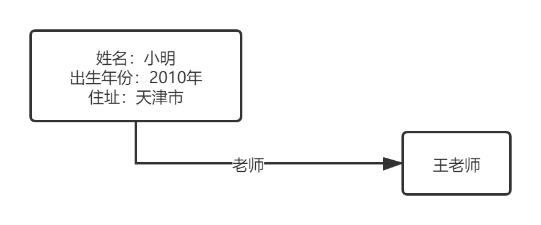
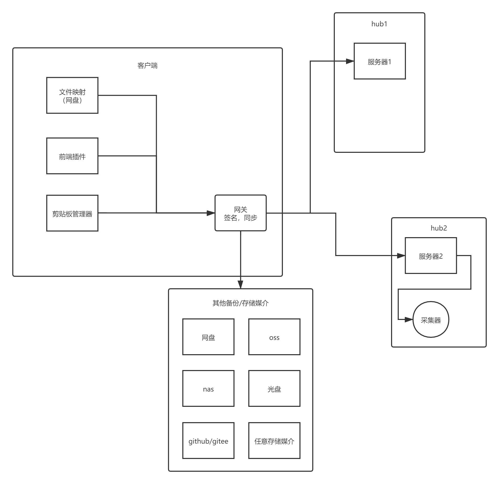
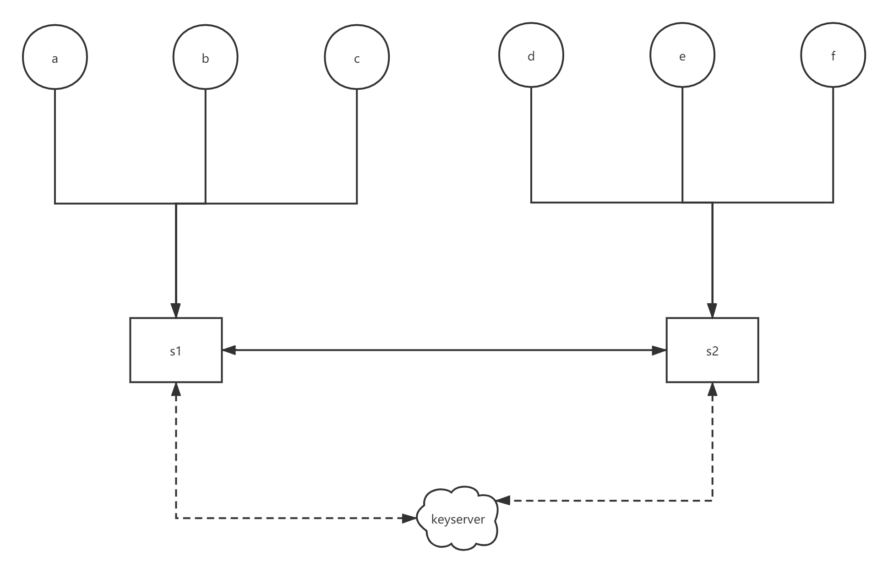

# third

> 一个关于信息存储、查询与分享的生态设想，按照固定方式的分享与存储信息，任意自选存储服务，基于公钥证书体系的生态系统。
>
> 在这个生态中，信息应该属于每个人，而服务商应该只提供计算（高级查询）和存储功能。每个人都能选择任何接入协议的任意工具进行编辑，每个人对自己的信息安全负责，信息的安全问题（仅泄漏问题，不包括安全问题）仅依赖自己，不需要运维或开发人员介入。

## 相关链接

- api测试服务器地址：[112.126.62.35](http://112.126.62.35/)(仅供测试，不保证数据安全性）
- 服务端：[third.server-python](https://github.com/Erriy/third.server-python)
- 客户端：[third.client-electron](https://github.com/Erriy/third.client-electron)
- vue 演示前端：[third.frontend-vue](https://github.com/Erriy/third.frontend-vue)

## 杂谈

> - 2020年04月15日 13:29
>
> 看楼下的小姑娘在骑车，骑着车的时候她能进行刹车、向前、向左、向右等等操作，但是只是一堆选项合集，人脑的决定只能根据输入（当前环境）进行生成一系列选择，永远也跳脱不出当前环境的影响，所以说人脑思维不自由。依照I(nput输入)-P(rocess处理)-O(utput输出)模型来看，多拓宽视野，多找点没了解过的事情，当经历沉淀成记忆的时候，你的思维才会相对来说更自由一些。多接触牛人，多看些历史，多去些地方去采集不同的环境输入，沉淀成记忆影响处理，最终输出一些不简单的东西。广度决定处理方法，深度决定是否专业。
>
> - 2020年04月17日 12:19
>
> 世间发明大多都是仿生学，环境如此，你很难跳脱出当前环境去思考问题，大部分发明无非是现有的东西的模拟并加一点点小小的突破。就如《三体》所说的“三与三十万综合症”一般，在三维空间这个环境里你无法真正理解四维空间，光速本身的限制让你无法超脱出光速之外去思考问题。我们所做的一切，都是在既有的框架之内，通过理解已存在的事物本身，再加上一点点思维上的突变，创造出一个世界上本不存在的东西。而这个东西，也将是下一次突破的基石。但如果世界本身不是这个样子，那个世界的未来和这个世界的未来是否有一些共通性？单纯从智慧体的角度来考虑，最重要的不是任何的外在展示形式，而是数据本身。数据内容会变，但数据永远存在，而数据处理也将永不停歇。说到底，世界自身也只是数据聚合体罢了。

### 可信

在了解https和git的时候，我觉得这两样东西很美，类似的还有拟态防御和spacex火箭的cpu冗余机制。

- https在不可信网络上提供可信连接（公钥/非对称加密）
- git在不可信设备上提供可信存储（多地冗余，主要关注分布式多地备份理念）
- 拟态防御在可能存在漏洞和后门的主机上提供可信服务（异构计算冗余）
- spacex火箭使用工业级cpu进行多芯片冗余来对抗粒子翻转（多芯片冗余）

以上所有的设计理念都是一致的，就是在相对不可信的环境上提供可信服务，主要涉及两种策略：

1. 基于数学理论上的难以破解
2. 基于冗余机制

### 信息与人

人的决定取决与他所了解信息的广度与深度。信息深度需要时间去理解与学习，很难快速提升，但是信息广度取决于周围的信息输入，可以通过增加信息输入快速提升，有时候你知道另一种方式会更容易理解一些信息或做出更好的决定。

有一段时间看微积分相关的一些基础知识时，看到一个有关加速度与距离的说法，求距离等同于几何求面积，所以从零匀加速一定时间后的移动距离本质上就是求三角形面积（以上内容我已经忘记了课程中是否包含）。

你现在做什么行业，本质并非是因为喜欢，而是因为接触过这个概念，知道有这个行业。如果对于一件事的解决方案，你可能只知道a，b两种，但是实际上还有c和d，一共四种。你的决定，取决于你知道两种还是四种解决方案。举例来讲，前段时间给手机换电池，但是手机螺丝滑丝了，查了下发现用胶水粘，实在不行就把周边挖出个坑然后用指甲刀拧出来（用的这个方法）。过后了一个月，我才又知道还有别的方法，用焊锡，还有专门处理滑丝的工具。

信息在不同的时间是有不同价值的，你要用到的时候能浮现的信息才是有用的信息。在看《真实一刻》纪录片的时候，看到两个场景很有感触。冰面塌陷时，人最好的解决方式应该是趴着去救，增加接触面积降低压强，降低自己脚下冰面也碎裂的风险。有山体滑坡风险的地方，游客可能并不知道，但是这些事却是很重要的事情。基于时间、地点、事件、声音、情景等触发器触发的信息更有价值。

基于情景触发可能很难，但是未来终有一天会实现，而我们要做的其实就是为未来的要使用的数据做好储备。

信息要辩证地看，特别是在信息泛滥的今天。可能今天你想购买一件物品，查到的数据全都是说这个商品有多好有多好的宣传文，而买到手之后才发现各种各样的问题。1000个好评应该跟1个差评并列展示，查找信息的时候应该有正反两方向结果，也能避免一部分类似魏则西事件的悲剧发生。（此处因seo和水军刷评等原因，需要设计信任链机制，详见下方信任链解释）

### 空间与速度与轮回

看《人类简史》后，理解了一份理念，当文字这种工具出现以后，人的思维得以延续，外置性的存储机制得以实现，这是一个0到1的过程，而造纸术是从1到10的过程，数据量急剧增加，各种典籍层出不穷。而近代计算机的发展，是10到100的过程，量变引起质变，在计算机体系下，不仅可以存储大量的数据，最重要的是快速通信以及自动化，不论是使用工具还是某些公司的服务，真正意义上的可以达到只要数据产生，就可以“永远”无法消失的“永恒”状态。

纵观人类历史，发展都是极其相似的：

- 东非大裂谷 > 跨海到达澳大利亚 > 跨空间之海到达月球，探索宇宙（人类生存空间越来越大）
- 徒步 > 骑马 > 汽车 > 火车 > 高铁 > 飞机 > 飞船 （人类运动速度越来越快）
- 大脑记忆 > 文字记录以及传输（书籍、信件） > 音频记录及传输 > 图像、视频记录及传输（数据存储空间越来越大，数据传输速度越来越快）

总结来讲，我对人类世界的认知是空间以及速度的变化，是一遍又一遍不断提升的轮回，像自相似分形，每一部分都自相似，像佛教中的一花一世界。

### 整理与查找与收藏与分享

随着科技的进步，每个人的数据也越来越多（照片、视频、笔记、节选内容、收藏文档），分布在不同的平台上，松散且难以管理，一个人的数据尚且如此，更何况将所有数据聚合到一起的互联网。互联网是现代人的共有记忆，互联网是一本书，一本由无数个节点拼接而成，由无数个人去读与写的一本书，一个不属于某个人而是全人类共有的一个数据存储装置。

一个乱堆东西的屋子和整理有序的仓库的查找效率是不一致的，就如同平衡二叉树一样，东西在存放的时候就应该考虑用的时候如何去查找的问题，按固定的方式去整理数据，回头数据才能真正的产生用处。

每个人搜索数据时，都是一种整理和过滤。每个人在收藏或分享某些数据的时候，都是对数据的一个认可。网络爬虫与人的行为一致，都是爬取数据的过程，反过来看也是这样，人浏览的行为本身就是在爬取数据，分享与收藏就是在过滤、筛选数据，我们可以拿人采集的数据构建一个更优良的人人为我、我为人人的搜索引擎。

## 为什么做（目前存在的问题）

### 可靠性

> 你的数据安全，不仅仅取决于你自己，依赖于公司运营状况，网络情况，开发、运维人员的安全意识。

- 服务商问题

  数据未备份而导致的数据丢失/被勒索者病毒加密；服务停运，限期下载；正常内容被错误的审核机制拦截，导致数据丢失

- 网络不可达

  网络拥堵、断网/局域网环境（线下比赛、家庭内部网络、高铁、飞机）或极端环境下（星际移民，高延迟通信）数据无法使用

- 恶意攻击

  身份信息中心化认证，信息没有安全验证机制，导致身份信息冒用，信息泄露等情况发生。

  > 某某平台用户信息被拖库；某某平台身份认证服务器被攻击导致身份冒用（twitter：我-秦始皇-打比特币）

### 体验限制

> 你的体验取决于运营人员的kpi

- 服务涨价
- 平台推广/广告
- 推荐算法使用户画地为牢
- 不同平台的优秀功能无法跨平台使用

### 信息快速获取

> 信息应该在你需要的时候自动浮现，而非主动查询。人与人的一个重大区别是查询能力而不是理解能力。

1. 怪圈：我不知道才去查，但是我需要知道一些东西才能查到
2. 有些事情你以为你知道，但其实你可能并不知道（举例：‘两肋插刀’由来）

### 组合查询

数据是有相关性的。一个人做出一个决定不仅取决于他自己，也跟当时的社会环境有关。历史的发展轨迹需要多个人掺杂在一起去看。

- 看人物传记（或百科），多个人物事迹混合成一条时间线的组合查询
- 看历史上的决策，与当时重大事件组合查看

### 信息追踪

- 跨平台追踪

  你关注的人（亲朋好友、up、明星等）、事（新闻、重要通知）在不同平台下的数据的线性查看。

- 时间线理顺

  看到某些事情，不明白之前发生了什么，事件应该是以时间线的形式来查看的

## 做成什么

一个由图数据库支撑的云文件系统，采用gpg体系进行身份以及完整性验证，基于触发器的数据自动展示，数据可控，来源可验证，多设备间同步。

用户自己拥有所有数据，可以选择服务商提供的空间和计算能力，也可自行在本机或云主机上搭建服务。

## 怎么做

### 涉及技术

- 公钥证书体系（主要是pgp加密和gpg实现）
- 图数据库（本系统主要使用neo4j社区版）

### 重要概念



#### 节点/基础信息

存储节点的基本信息，类似已有文件系统中的文件内容，包含本节点内的一些信息或基础属性信息。

节点包括签名，内容可为任意内容（包括加密后的信息）

以小明同学举例：

属性/字典式（更直观且方便解析，亦可直接生成表格，推荐）：

- 姓名：小明
- 出生年份：2010年
- 住址：天津市

描述文本：

- 小明在2010年出生，现在住在天津市

#### 关系/链接信息

与基本节点相关联的节点信息。

以小明同学和他的老师王老师为例：

- 名称：王老师

加入链接信息的小明的信息

- 姓名：小明
- 出生年份：2010年
- 住址：天津市
- [老师]：(王老师)

本质与节点的基础信息没有区别，但因为是关联实体，所以是链接信息，而非基本的属性信息。

#### 信任（链/网）

> 类gpg体系的信任链。

如存在一下信任关系（指向则为信任）：

- a->b->c->d

当你作为一个新用户，信任a的时候，则可以通过信任深度来过滤信息：

- 信任深度为-1或未指定，展示所有信息
- 信任深度为0，展示自己认可的信息
- 信任深度为1，展示自己和a所认可的信息
- 信任深度为2，展示自己、a、b所认可的信息
- 信任深度为3，展示自己、a、b、c所认可的信息
- 信任深度为4，展示自己、a、b、c、d所认可的信息

假设每人信任十个人，则深度为1时，信任网络中的人为11个；信任深度为4时，信任网络中的人为11111个。

按照四/六度分隔理论（本例以4层为例），最多4层网络足以筛选掉所有的未经信任的数据。

### 重要结构

- seed

  ``` json
  {
      // json序列化后的seed，防止不同语言因json序列化结果不一致而导致的签名无法验证
      // 对象内部结构见下方json_seed
      'json': '...',
      // 签名信息列表，如果json结构中包含作者信息，则必须包含这个作者的签名，否则视为无效
      'sign': [...],
      // 全id为metadata.id.value-fingerprint(代表使用这个id的人)-sha256(json字段的sha256)-timestamp(更新版本时间戳)
      // metadata.id.value =
      // id 可由seed计算出，传输过程中无需携带
      'id': '...'
  }
  ```

- seed.json

  ``` json
  {
      // 元信息
      'metadata': {
  		// 字段id
          'id': {
              // 类别，例如url，默认不指定为seedid
              'type': '...',
              // id，唯一性id，如果是url类型，则id为url值
              //  fingeprint_short(代表最初创建这个id的人或一些人的指纹)_randomstring(随机字符串，防止极端条件下产生的冲突)_metadata.time.update.ts(第一次创建时的时间戳，以秒为单位)
              'value': '...'
          },
          // 作者信息，作者的证书指纹列表，全部大写
          'author': ['...'],
          // 时间相关信息
          'time': {
              // 更新/创建事件
              'update': {
                  // 时间戳
                  'timestamp': ...,
                  // 时间精度，比如year，month，day，hour
                  'accuracy': '...'
              },
              // 开始相关信息，结构同update
              "start": {...},
              // 结束相关信息，结构同update
              "end": {...}
          },
          // 地点相关信息
          "position": {
              // 后续如果有超脱于经纬度的数据，比如宇宙空间坐标，再增加字段进行描述
              // 经度
              "longitude": 1.111,
              // 纬度
              "latitude": -1.111
          },
          // 指向的链接
          'link': [
              {
                  // 指向的seedid
                  'id': '...',
                  // 关系名称
                  'name': '...'
              }
          ]
      },
      // 数据信息，可以为对象、列表或数据
      'data': ...
  }
  ```

### 生态架构



#### 软件

- 客户端
  - 移动端
    - 文件映射
    - 剪贴板管理
    - 文本编辑
    - 基于gps或其他触发器的自动触发
  - pc端
    - 网关
      - 文件映射（网盘）
      - 剪贴板管理器
      - 服务自发现（ssdp，类似内网TV自发现）
      - 多地备份
    - 浏览器插件
      - 划选采集内容
      - 高亮显示划选内容
      - 批注（对页面的批注，对高亮内容的批注，对批注的批注，对批注的批注的批注）
- 服务端（hub）

#### 参与者

- 使用者

  - 内容消费
  - 内容产出
  - 内容搬运/整理
  - 内容筛选

- 开发者

  - 定制开发
  - 卖客户端

- 服务商（整合服务）

  > 不是所有的人都愿意自建服务，也不是所有的自建服务都能高效利用
  >
  > 服务商主要提供廉价（自建服务利用率不高）和稳定（专门对数据进行备份）的服务。
  >
  > 服务本身也是互动社区。

  - 售卖空间和计算能力
  - 保证数据安全（用户依然可以本地自建服务或对数据进行冷存储）

### 数据自动拉取（依赖于keyserver，根据指纹拉取）

> 当然也可以不拉取，直接使用多个服务器，结果在客户端汇总。
>
> 注意：目前还不支持，等服务端完善之后做后续支持
>
> 利用keyserver实现类似dns的功能，以公钥中的uid.comment进行“域名”解析，实现效果：根据指纹信息自动解析到其使用的服务器和发布的内容。



> abc三个人使用s1，def三人使用s2
>
> 当a关注d的时候：
>
> 1. s1根据d的指纹信息去keyserver中拉取d的公钥
> 2. s1解析d公钥中的uid信息中包含的comment信息获得d所使用的服务器信息（标记为ds）
> 3. s1根据ds去s2中拉取d的信息并保存

## Q&A

### 证书过期或吊销了之前的数据无法验证怎么办

对身份认证极其敏感的信息，自行将seedid压入受信区块链。seedid包含作者指纹和json的sha256，可确定信息发布时间在证书吊销或过期之前。


## 研发计划

### 后端 v0.1.0b（2020年12月6日）

- [ ] 并集查询
- [ ] 管理员接口
  - [ ] 证书访问权限配置

### 移动端 v0.1.0（2020年12月7日开始，预计2-3周时间）

- [ ] 创建内容（笔记、日记等功能）
- [ ] 分享内容，对内容进行打标签（人人索引计划）
- [ ] 内容查询，多级信任链机制

